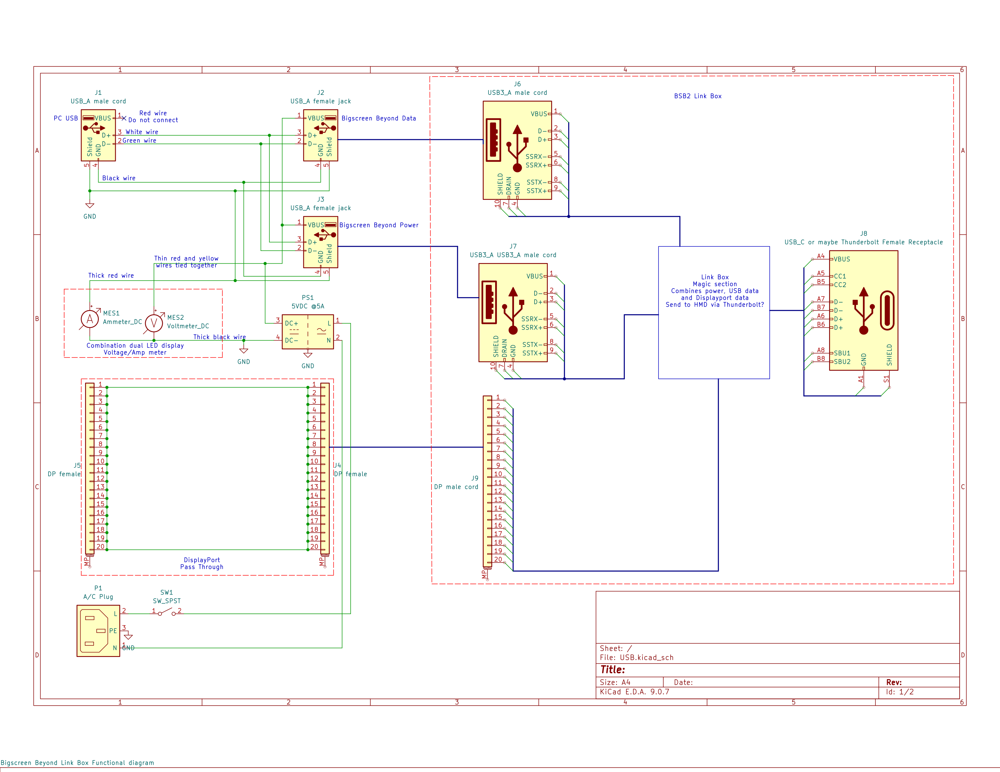

# Bigscreen-Beyond-2-BSB2-powerbox
External power supply with BSB's link box in a self contained box for better performance of the BSB2.

This is an external power source for a Bigscreen Beyond 2 (BSB2).

I use my BSB2 mainly for flying helicopters in Eagle Dynamic's Digital Combat Simulator (DCS).

Had issues with random gray outs.  Then it died.  Trouble shot it and deterimined that the link box had faied.  Contacted Bigscreen's support via email.  They thought it might be the BSB2.  Sent it to them.  They performed a full diagnosic and it passed with flying colors.  Sent my BSB2 with a replacement link box, a booster for the uplink cable and a new uplink cable.

After that it work great for about a week.  Then it would randomly disconnect and reconnect resulting in a black display for about 10 to 15 seconds.  Tried connecting to assorted wall wart power supplies, but still had the same issue.  When I ran it without the booster I did not get the disconnects, but the gray outs returned.

So, I decided to build a dedicated power with enough amperage to support the BSB2.  Placed it in a platic .30 caliber ammo box from Harbor Freight.  Added a voltage and amp meter.  Without the BSB2 and link box connected, it was reading 4.9VDC at .09A.  With the BSB2 connected not in a VR session the voltage dropps to 4.8VDC with .84A.  When I go into DCS the voltage stays at 4.8VDC and the current goes to 1.3A with occasional peaks of 1.43A.

Ran it for multiple hours for two days without any black outs nor gray outs.  Only thjing that gets warm in the box is the 5VDC power supply.

Schematic is shown below.

In my build I did not put in the power switch.  I used remote controlled outlets to turn it and the two base stations on and off.

J-1 is a USB-A male plug on a cable.  It could be a USB-C male plug if so desired.  Do not know if the BSB2 accepts USB 3 data.  The USB cables onb the link box are blue indicating it is USB 3.  Everything I have read or watched seems to indicate USB 2 data is used for the light house receivers and audio.  USB parts listed below and in the scmatic are for USB 2.

A USB-A male replacement/repair cable is used to connect to the PC.
https://www.amazon.com/HATMINI-USB-Male-Equipment-Replacement/dp/B0CRQ21J7T?th

This is a USB-C male replacement/repair cable.  Note: it only provides USB 2 data.
https://www.amazon.com/dp/B0CRQ1X8YN

J2 and J3 are female USB-A breakout boards with screw terminals.  D+ and D- are not required for the USB connector labeled POWER.  If they are connected, either jack can be used as data or power.  This is how the schematic is drawn.
https://www.amazon.com/risingsaplings-Breakout-Terminal-Adapter-Connector/dp/B0D576XRNM

Voltage and Amp meters are a single device with two LED displays. It has two plugs, a two wire (thick red and black wires) and a three wire (thin red, yellow and black).  Two wire plug is for Amps.  Thick black wire goes to power supply ground, negative terminal.  Thick red wire is used as the ground (GND) wire for the USB connections.
Three thin wires are used for voltage measurements.  Black wire is not used.  Red and yellow wires are connected together then tied to the Power supply's
positive terminal along with the VBUS line from the two female USB jacks.
https://www.amazon.com/diymore-Digital-Voltmeter-Ammeter-Red-Blue/dp/B08HQM1RMF?th

Power supply is 5VDC at 5A commonly found on Amazon and Aliexpress.  From testing, 5A should be more than sufficient.  Since these cheap Chinese power supplies are usually over rated on the current out put it is best to get one that provides about twice the current you expect to need.
https://www.amazon.com/DIGISHUO-Transformer-Switching-Converter-Security/dp/B098SSSB1F

Voltage and current from a PC's USB ports are not very reliable, even on high end boards with a high wattage PSU. During testing with a BSB2, the max amperage observed has been 1.43A.  BSB2e will require
a bit more.
USB-1 and 2 are rated at 500mA or .5A.  USB-3 is 900mA or .9A.  This is insufficient to power the BSB2 and BSB2e.  USB-3.1 and 3.2 using a USB-C connection is rated at 3A.  I still had issues with USB-C ports on my computer.
Using a dedicated power supply like this provides more power and better stability.

A Displayport passthrough is used to connect the link box's display connector to a Displayport cable connected to the PC.
https://www.amazon.com/dp/B0BC85JTDJ

As menmtioned before, this was assembled in a .30 cliber plastice ammo can from Harbor Freight.  There are similar models on Amazon.
Harbor Freight
https://www.harborfreight.com/030-caliber-ammo-box-63135.html
Amazon
https://www.amazon.com/Plano-Ammunition-Heavy-Duty-Water-Resistant-Protection/dp/B07RC83LTZ

Power and USB cords have a knot tied on the inside of the box to prevent them from peing pulled out the holes I drilled for them.  It is recommended to use grommets to prevent the wires from wearing through
and shorting out on the walls of the ammo box.
https://www.amazon.com/Silicone-Grommets-Automotive-Protection-Irrigation/dp/B0DF81PH8X

